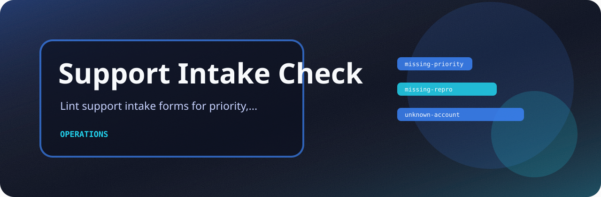
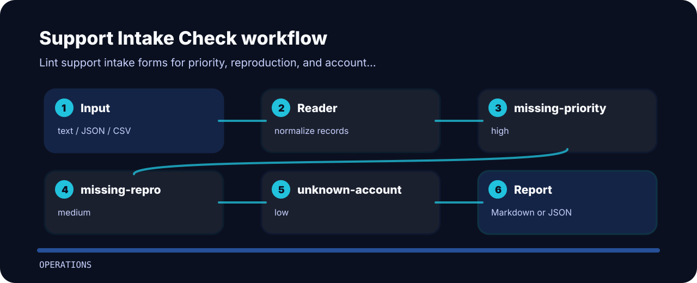

# Support Intake Check



## What it protects

Lint support intake forms for priority, reproduction, and account fields. It keeps the review small: one input file, a short list of findings, and enough context to fix the line that caused the warning.

| Detail | Value |
| --- | --- |
| Area | operations |
| Entry | `support-intake-check` |
| Input | plain text |
| Output | terminal findings, optional JSON |

## How the check reads



| Signal | Level | What it flags | Fix direction |
| --- | --- | --- | --- |
| `missing-priority` | high | priority field missing | add priority field |
| `missing-repro` | medium | reproduction steps missing | request repro details |
| `unknown-account` | low | account identifier missing | capture account identifier |

## Try the fixture

```bash
git clone https://github.com/mertefekurt/support-intake-check.git
cd support-intake-check
python -m pip install -e ".[dev]"
support-intake-check examples/sample.txt
```
